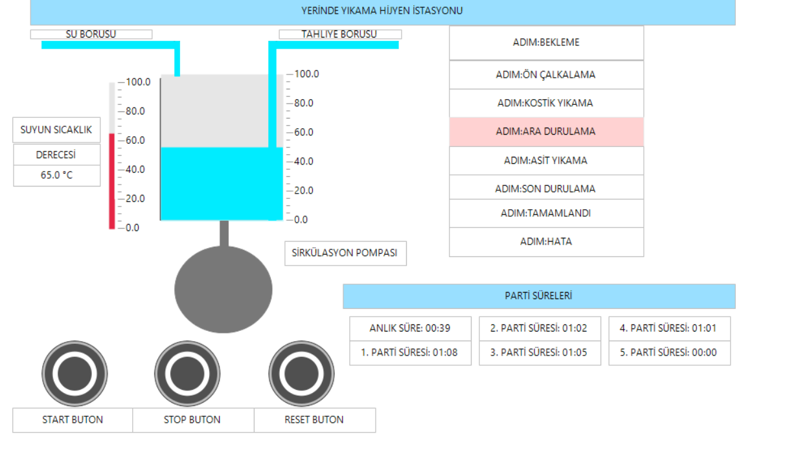

# CIP-Industrial-Cleaning-System-PLC
Industrial CIP Automation and HMI Simulation
# Endüstriyel CIP (Clean-in-Place) Otomasyon Sistemi ve HMI Simülasyonu

Bu proje; gıda, içecek ve kimya sektörlerinde yaygın olarak kullanılan **CIP (Yerinde Temizleme / Clean-in-Place)** istasyonunun **CODESYS V3.5** geliştirme ortamında, **IEC 61131-3** standartlarında ve **Structured Text (ST)** programlama diliyle tasarlanmış kapsamlı bir otomasyon ve proses kontrol projesidir.

Proje yalnızca mantıksal sıralama yapmakla kalmayıp; sahadaki aktüatör ve sensör davranışlarını simüle eden matematiksel modelleri, modüler nesne tabanlı kontrol bloklarını ve operatör için tasarlanmış gerçek zamanlı bir HMI görselleştirmesini içerir.

---

## Sistem Mimarisi ve Yazılım Standartları

Yazılım mimarisi, kod tekrarını önleyen, test edilebilirliği artıran ve sahada kolay bakım sağlayan modüler bir yapıda tasarlanmıştır:

- **Programlama Dili:** IEC 61131-3 Structured Text (ST)
- **Geliştirme Platformu:** CODESYS V3.5 SP22 Patch 3 (SoftPLC Control Win V3 x64)
- **Mimari Yaklaşım:** Modüler Fonksiyon Blokları (`FUNCTION_BLOCK`), Veri Tipleri (`STRUCT`), Durum Numaralandırmaları (`ENUM`) ve Ayrılmış Görev Konfigürasyonu (`Task Configuration`).

---

## CIP Proses Adımları ve Sonlu Durum Makinesi (Finite State Machine)

Sistem sıralı yıkama adımlarını yönetmek için `Enum_CIP` durum makinesini kullanır. Her adımda tank doluluk seviyesi ve proses hedefleri doğrulanmadan bir sonraki faza geçilmez:

1. **BEKLEME:** Sistem başlangıç durumu. Bütün vanalar kapalı, aktüatörler güvenli konumda ve operatörden gelen `Start` emrini bekler.
2. **ÖN ÇALKALAMA:** Su vanası açılarak tanka su alınır, sirkülasyon pompası çalıştırılarak hatta kaba tortular temizlenir ve tahliye edilir.
3. **SICAK KOSTİK YIKAMA:** Organik kirlerin ve yağların sökülmesi için kostik vanası açılır, rezistans ve pompa devreye girer. **Kritik Güvenlik/Kalite Şartı:** Sıvı sıcaklığı `65.0°C` değerine ulaşana kadar proses süresi sayacı işletilmez; kimyasal reaksiyon sıcaklığı sağlandıktan sonra geri sayım başlar.
4. **ARA DURULAMA:** Kimyasal kalıntıların nötralize edilmesi ve hattan uzaklaştırılması amacıyla temiz su ile yıkama ve tahliye yapılır.
5. **ASİT YIKAMA:** İnorganik kireç ve mineral kalıntıların temizlenmesi için asit çözeltisi hatta dolaştırılır.
6. **SON DURULAMA:** Hattı tekrar üretime hazır hale getirmek için nihai temiz su durulaması gerçekleştirilir.
7. **TAMAMLANDI:** Bütün yıkama sekansı başarıyla sonlandırılır. Toplam çevrim süresi hesaplanır ve hafıza dizisine aktarılır.
8. **HATA:** Acil stop, aşırı sıcaklık veya pompa arızasında sistem bu adıma düşerek tüm vanaları ve çıkışları emniyetle kapatır.

---

## Modüler Fonksiyon Blokları (POU)

### 1. `FB_ValveWithAlarm` (Akıllı Vana Kontrolü)
Pnömatik/selenoid vanaları kumanda eder. Sahadan gelen geri bildirim limit switch'lerini takip eder:
- Açılma ve kapanma komutları sonrasında fiziksel vananın pozisyona geçmesi için bir zamanlayıcı (`TON`) çalıştırır.
- Vana belirtilen süre (`tTimeout`) içinde açık/kapalı sınır sensörüne ulaşamazsa veya aynı anda hem açık hem kapalı sensörü gelirse sistem bunu arıza (`bAlarm`) olarak yakalar ve hafızaya alır.
- Güvenli `bReset` girişiyle arıza giderilmeden vana tekrar açılmaz.

### 2. `FB_Motor_V2` (Sirkülasyon Pompası ve Termik Koruma)
Sirkülasyon pompasını kontrol eder ve motor sağlığını izler:
- Motor çalıştırıldığında sahadan gelen `bRunningFeedBack` sinyalini doğrular.
- Sahadan motor koruma şalteri/termik rölesi üzerinden gelen `bTrip` sinyalini anında kesici komut olarak algılar ve donanımsal arıza alarmını aktif eder.
- `ST_MotorData` veri yapısını parametre olarak alarak kod karmaşasını önler.

### 3. `FB_HeaterControl` (Sıcaklık ve Rezistans Emniyeti)
Kostik hattındaki elektrikli ısıtıcı rezistansı kumanda eder:
- Anlık analog sıcaklık değerini (`rCurrentTemp`) yazılımsal üst sınır olan `rMaxTempLimit` (120.0°C) ile kıyaslar.
- Olası PLC/yazılım donmalarına karşı sahadan bağımsız gelen mekanik acil durum termostat switch'ini (`bOverheatSwitch`) izler.
- Herhangi bir aşırı sıcaklık durumunda rezistansı anında enerjisiz bırakır ve operatör onaylı sıfırlama (`bReset`) yapılana kadar kilitli tutar.

---

## Veri Kaydı ve Parti Takibi (Data Logging)

- **FIFO / Dizi Yönetimi:** Sistemde tamamlanan son 5 yıkama partisinin çevrim süreleri `SonPartiSureleri : ARRAY[1..5] OF TIME` dizisinde tutulur.
- Her yıkama tamamlandığında parti süresi dizinin ilgili indeksine yazılır, indeks takibi yapılarak geçmiş 5 partinin performansı HMI tablosu üzerinde operatöre raporlanır.

---

## Güvenlik ve E-Stop Katmanı

- **Acil Stop (`bAcilStop`):** Butona basıldığı anda tüm durum sayaçları durdurulur; ısıtıcı rezistansı, sirkülasyon motoru ve tüm kimyasal giriş vanaları kilitlenerek güvenli tahliye moduna geçirilir.
- **Kombine Alarm:** Sistemdeki herhangi bir vana geri bildirim hatası, motor arızası veya termostat açması durumunda `bGenelAriza` biti tetiklenir ve durum makinesi otomatik olarak `Enum_CIP.HATA` moduna yönlendirilir.

---

## Simülasyon ve Dinamik Model

Gerçek saha donanımı olmadan test ve doğrulama yapılabilmesi için projeye matematiksel simülasyon dinamikleri dahil edilmiştir:
- **Tank Seviyesi:** Vanaların açık/kapalı durumuna ve basılan sıvı debisine bağlı olarak seviye değişkeni (`rSuSeviyesi`) adım adım dinamik olarak doldurulur veya tahliye edilir.
- **Termodinamik Isınma/Soğuma Modeli:** Isıtıcı aktif olduğunda zamana bağlı lineer ısı transfer katsayısı (`IsinmaHizi`) ile sıvı sıcaklığı yükseltilir; ısıtıcı kapatıldığında ortam ısısına doğru kontrollü soğuma eğrisi işletilir.

---

## Projeyi Çalıştırma

1. Proje dizininde yer alan `CIP_Industrial_Automation.projectarchive` dosyasını indirin.
2. CODESYS V3.5 üzerinde **File -> Project Archive -> Extract Archive...** menüsünden arşivi açın.
3. Cihaz ağacından **Application** üzerine sağ tıklayıp **Simulation** moduna geçin.
4. **Build (F11)** işlemiyle projeyi derleyin ve PLC'ye yükleyin (**Online -> Login / F5**).
5. **Visualization** sekmesini açarak `START`, `STOP` ve `RESET` butonlarıyla prosesi gerçek zamanlı simüle edin.
